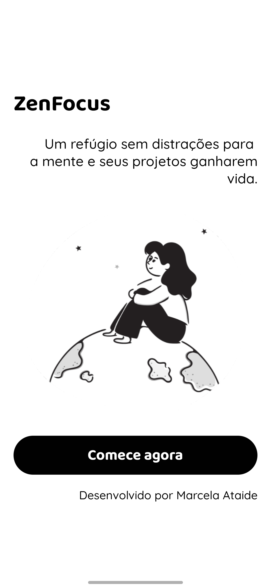
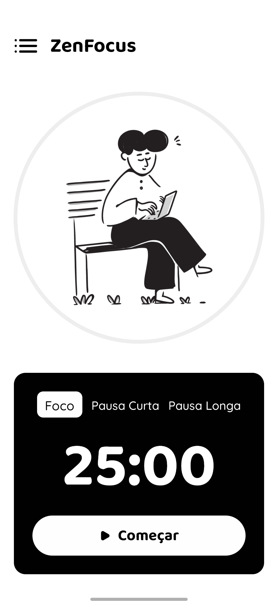
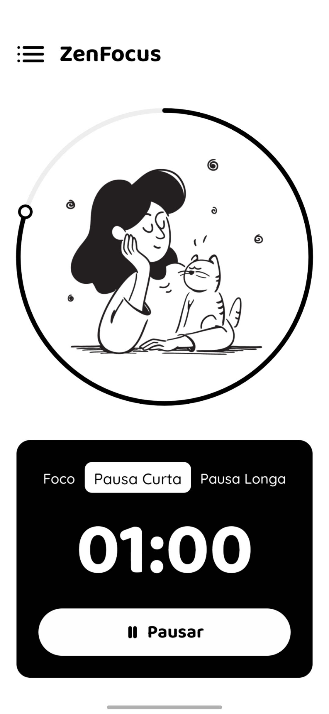
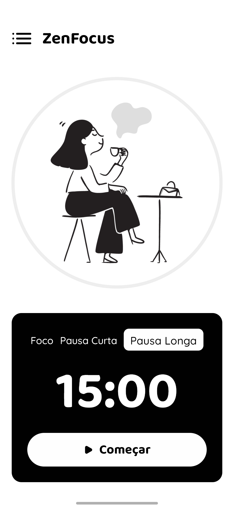
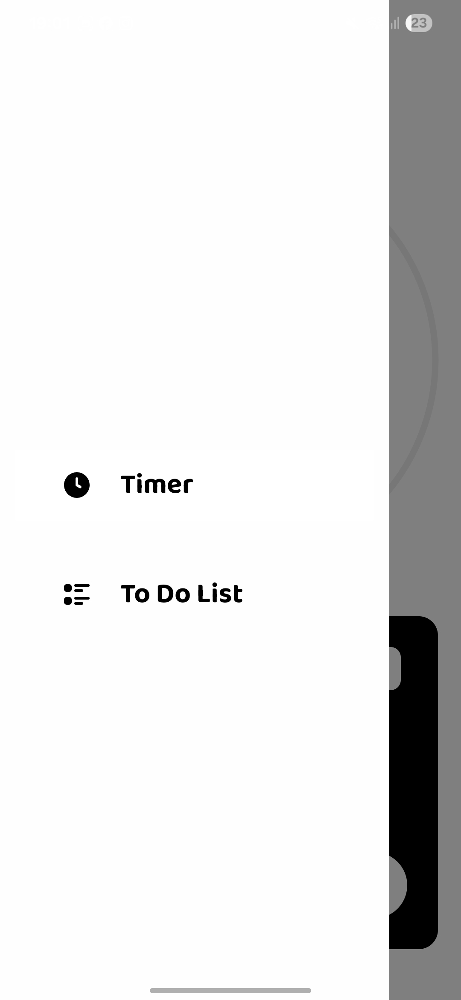
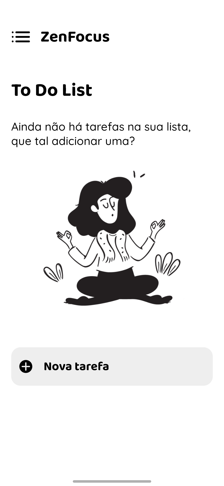
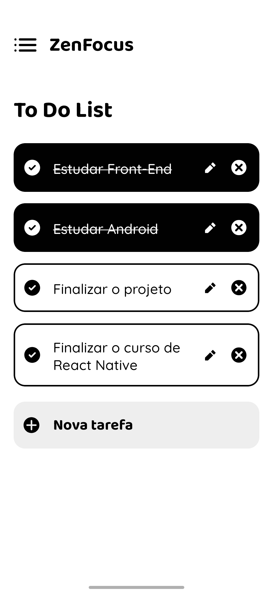
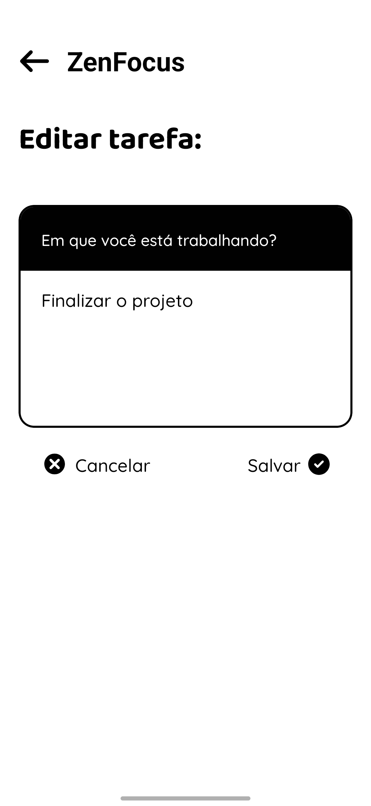

# 🌱 Zen Focus

Bem-vindo(a) ao projejto **Zen Focus**! Um aplicativo feito para ajudar a encontrar o equilíbrio entre produtividade e bem-estar.

Inspirado na técnica Pomodoro, o ZenFocus foi criado para quem deseja manter o foco em suas tarefas sem deixar de respeitar seus momentos de descanso. Com uma interface simples e intuitiva, ele combina um timer personalizado com uma lista de tarefas prática e eficiente.
Ideal para estudantes, profissionais e qualquer pessoa que deseje organizar melhor o tempo, manter a mente clara e alcançar objetivos com mais leveza.

## ✨ Funcionalidades

- ✅ **Tela Inicial**: uma breve apresentação e ponto de partida para navegação no app.
- ⏱️ **Timer Pomodoro** com três contextos:
  - **Foco**: 25 minutos para sessões concentradas de trabalho
  - **Pausa Curta**: 5 minutos para pequenos descansos
  - **Pausa Longa**: 15 minutos para intervalos maiores
- 📝 **To-do List**:
  - Adicionar novas tarefas
  - Editar tarefas existentes
  - Excluir tarefas existentes
- 💾 **Salvamento local de dados** para manter suas tarefas mesmo após fechar o app

## 🛠️ Tecnologias Utilizadas

- [Expo](https://expo.dev/) – para build e execução rápida do app
- [React Native](https://reactnative.dev/) – construção da interface
- **JavaScript (ES6+)** – lógica e estrutura
- **Context API** – gerenciamento de estado entre componentes

## 🤖 Instalação

> Requisitos: Node.js, npm/yarn e Expo CLI instalados

1. Clone o repositório:

```bash
git clone https://github.com/seu-usuario/zen-focus.git
cd zen-focus
```

2. Instale as dependências:

```bash
npm install
```

3. Inicie o projeto com o Expo:

``` bash
npx expo start
```

📌 Caso o app não conecte (problemas de rede/firewall), use o modo túnel:

```bash
npx expo start --tunnel
```

5. Escaneie o QR code no terminal com o app Expo Go no seu celular.

## 📱 Gerar APK

Faça o build:

``` bash
eas build --platform android --profile preview
```

## 📸 Capturas de Tela

### Tela Inicial:
<div style="display: flex; gap: 15px;">
   
   
   
   
   
   
   
   
   
</div>

## 👩🏻‍💻 Autor
Desenvolvido por Marcela Ataide

## 📄 Licença
Este projeto está licenciado sob a MIT License.
Sinta-se livre para usar, modificar e compartilhar como quiser.
